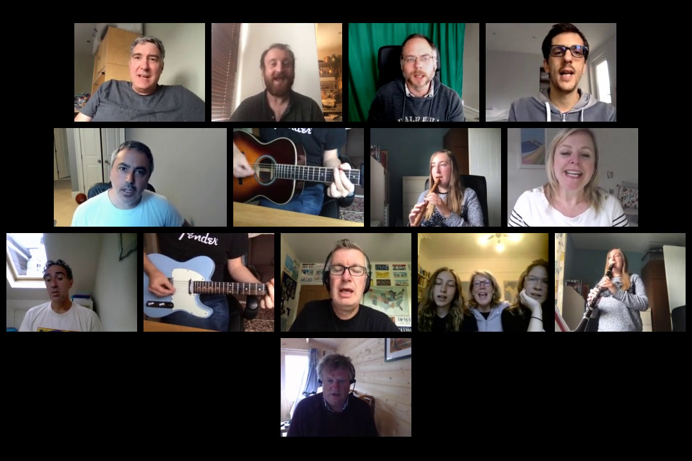

# Smiler

This is a library and CLI tool to extract the "smiliest" of frame from a video of people.

It was developed as part of [Choirless](https://github.com/choirless) as part of
[IBM Call for code](https://callforcode.org).

## Installation

```
% pip install choirless_smiler
```

## Usage

Simple usage:
```
% smiler video.mp4 snapshot.jpg
```



It will do a pre-scan to determine the 5% most changed frames from their previous frame
in order to just consider them. If you know the threshold of change you want to use you
can use that. e.g.

```
% smiler video.mp4 snapshot.jpg --threshold 480000
```

## Help

```
% smiler -h
usage: smiler [-h] [--verbose] [--threshold THRESHOLD] [--quantile QUANTILE]
              video_fn image_fn

Save thumbnail of smiliest frame in video

positional arguments:
  video_fn              filename for video to analyse
  image_fn              filename for output thumbnail

optional arguments:
  -h, --help            show this help message and exit
  --verbose             verbose mode
  --threshold THRESHOLD
                        threshold of difference over which we analyse an image
  --quantile QUANTILE   quantile of images to analyse
```

## Re-training

There are some scripts in the `scripts` directory in the
[Github repo](https://github.com/choirless/smiler)
to generate new images and to aid manual classification
and retraining of the model.

